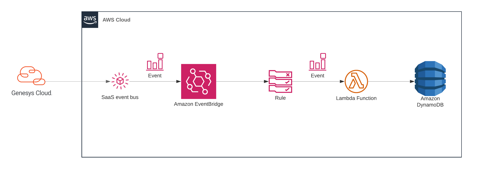
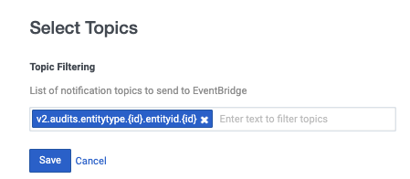

This Genesys Cloud Developer Blueprint provides an example of how to write a Lambda function that responds to user presence updates and writes them to a DynamoDB table. This blueprint includes a SAM template with Typescript and Python Lambda functions for the CloudFormation stack that is used in this solution.



* [Solution components](#solution-components "Goes to the Solutions components section")
* [Software development kits (SDKs)](#software-development-kits-sdks "Goes to the Software development kits section")
* [Prerequisites](#prerequisites "Goes to the Prerequisites section")
* [Implementation steps](#implementation-steps "Goes to the Implementation steps section")
* [Additional resources](#additional-resources "Goes to the Additional resources section")

## Solution components

* **[Genesys Cloud](https://www.genesys.com/genesys-cloud "Opens the Genesys Cloud website")** - A suite of Genesys cloud services for enterprise-grade communications, collaboration, and contact center management. You create and manage OAuth clients in Genesys Cloud.
* **[AWS Serverless Application Model (SAM) Command Line Interface (CLI)](https://aws.amazon.com/serverless/sam/ "Opens the AWS SAM CLI website")** - A cross-platform CLI that provides a Lambda-like execution environment for locally building, testing, and debugging applications defined by SAM templates.
* **[Amazon DynamoDB](https://aws.amazon.com/dynamodb/ "Opens the Amazon DynamoDB website")** - A highly available, highly scalable NoSQL database that provides fast and predictable performance in a multi-region environment.
* **[AWS Lambda](https://aws.amazon.com/lambda/ "Opens the AWS Lambda website")** - A serverless computing service for running code without creating or maintaining the underlying infrastructure.
* **[Amazon EventBridge](https://aws.amazon.com/eventbridge/ "Opens the Amazon EventBridge website")** - A scalable, serverless event bus that streams real-time data to selected targets based on custom routing rules.
* **[AWS CloudFormation](https://aws.amazon.com/cloudformation/ "Opens the AWS CloudFormation website")** - A service that gives developers and businesses an easy way to create a collection of related AWS and third-party resources, and provision and manage them in an orderly and predictable fashion.
* **[Node.js](https://nodejs.org/en/ "Opens the NodeJs website")** - An open-source, cross-platform JavaScript runtime environment.
* **[Python](https://www.python.org/ "Opens the Python website")** - An interpreted, high-level programming language that is used to quickly build modularized, object-oriented programs.

## Software development kits (SDKs)

* **[AWS SDK for Python (Boto3)](https://aws.amazon.com/sdk-for-python/ "Opens the AWS SDK for Python (Boto3) page on the Amazon website")** - Enables developers to build and deploy Python applications that integrate with AWS services. This blueprint uses Boto3 to write user presence updates to Amazon DynamoDB.
* **[AWS SDK for JavaScript](https://aws.amazon.com/sdk-for-javascript/ "Opens the AWS SDK for JavaScript page on the Amazon website")** - Enables developers to build and deploy JavaScript applications that use AWS services. This blueprint uses the AWS SDK for JavaScript to write user presence updates to DynamoDB.

## Prerequisites

### Specialized knowledge

* AWS Cloud Practitioner-level knowledge of AWS CloudFormation, AWS IAM, AWS Lambda, AWS SAM CLI, Amazon DynamoDB, and Amazon EventBridge
* Experience with TypeScript, JavaScript, or Python

### Genesys Cloud account

* A Genesys Cloud license. For more information, see [Genesys Cloud pricing](https://www.genesys.com/pricing "Opens the Genesys Cloud pricing page") on the Genesys website.

### AWS user account  
* An administrator account with permissions to access the following services:
  * AWS Identity and Access Management (IAM)
  * AWS Lambda
* AWS credentials. For more information about setting up your AWS credentials on your local machine, see [About credential providers](https://docs.aws.amazon.com/sdkref/latest/guide/creds-config-files.html "Goes to The shared config and credentials files page") in AWS documentation.
* AWS SAM CLI version 1.23.0 or later. For more information, see [Install AWS SAM](https://docs.aws.amazon.com/serverless-application-model/latest/developerguide/serverless-sam-cli-install.html "Goes to the Install AWS SAM CLI page") on the AWS website.

### Third-party software

* Python version 3.8.10 or later. For more information, see [Download Python](https://www.python.org/downloads/ "Opens the Download Python page") on the Python website.
* Node.js version 14.0.0 or later. For more information, see [Node.js](https://nodejs.org/en/ "Opens the Node.js page") on the Node.js website.

## Implementation steps

* [Clone the repository containing the project files](#clone-the-repository-containing-the-project-files "Goes to the Clone the repository containing the project files section")
* [Enable the Amazon EventBridge Source integration in your Genesys Cloud account](#enable-the-amazon-eventbridge-source-integration-in-your-genesys-cloud-account "Goes to the Enable the Amazon EventBridge Source integration in your Genesys Cloud account section")
* [Configure your EventBridge software as a service (SaaS) integration](#configure-your-eventbridge-software-as-a-service--saas--integration "Goes to the Configure your EventBridge software as a service (SaaS) integration section")
* [Edit the TypeScript config file](#edit-the-typescript-config-file "Goes to the Edit the TypeScript config file section")
* [Build and deploy the application](#build-and-deploy-the-application "Goes to the Build and deploy the application section")
* [Trigger a user presence update](#trigger-a-user-presence-update "Goes to the Trigger a user presence update section")
* [View the user presence table in DynamoDB](#view-the-user-presence-table-in-dynamodb "Goes to the View the user presence table in DynamoDB section")

### Clone the repository containing the project files

1. Clone the [aws-eventbridge-user-presence-update-blueprint](https://github.com/GenesysCloudBlueprints/aws-eventbridge-user-presence-update-blueprint "Opens the aws-eventbridge-user-presence-update-blueprint repository in GitHub") repository from GitHub to your local environment.

### Enable the Amazon EventBridge Source integration in your Genesys Cloud organization

1. In Genesys Cloud, install an Amazon EventBridge Source integration. For more information, see [Install Amazon EventBridge integration from Genesys AppFoundry](https://help.mypurecloud.com/?p=228013 "Goes to the Install Amazon EventBridge integration from Genesys AppFoundry article") in the Genesys Cloud Resource Center.

2. Configure the integration with the following settings:
  * **AWS Account ID**: Your AWS account ID
  * **AWS Account region**: Your [AWS account region](/api/rest/ "Goes to the Platform API page in the Genesys Cloud Developer Center")
  * **Event Source Suffix**: Your preferred suffix that identifies the source of the events
  * **Topic Filtering**: Select `v2.audits.entitytype.{id}.entityid.{id}`. This value corresponds to the event action on the AWS Lambda function.

    

  For more information, see [Configure the Amazon EventBridge integration](https://help.mypurecloud.com/?p=228016 "Goes to the Configure the Amazon EventBridge integration article") in the Genesys Cloud Resource Center.

### Configure your EventBridge Software as a Service (SaaS) integration

1. In your AWS account, configure your [EventBridge software as a service (SaaS)](https://console.aws.amazon.com/events/home?region=us-east-1#/partners) integration.
2. Make a note of the event source name (for example, `aws.partner/example.com/1234567890/test-event-source`).
3. Before proceeding to the next step, verify that your event source is listed as **Pending**.

### Edit the TypeScript config file

:::primary
**Note**: This is necessary only if you want to use the TypeScript Lambda. If you do not want to use the TypeScript Lambda, feel free to remove the source code of either Lambda function and remove the references to it from the template.yaml file. Then, skip to the section, [Build and deploy the application](#build-and-deploy-the-application "Goes to the Build and deploy the application section")
:::

1. In your local copy of the [aws-eventbridge-user-presence-update-blueprint](https://github.com/GenesysCloudBlueprints/aws-eventbridge-user-presence-update-blueprint "Opens the aws-eventbridge-user-presence-update-blueprint repository in GitHub") repository, go to **src** > **typescript** > **src**.

2. Edit the config.ts file to use these settings:

  * **region**: specify your AWS account region.
  * **table_name**: specify the value that corresponds with the `EventBridgeUserPresenceTable` value in the template.yaml file.  

### Build and deploy the application

1. To build the application, from the repo root, run the following command:

  ```
  sam build
  ```
When this command runs, the SAM CLI resolves the dependencies of both Lambda functions, builds them, and stores the artifacts in a directory named `.aws-sam`.


2. Deploy the application. The following command will use CloudFormation to create the necessary resources for this application (roles, Lambdas, DynamoDB table, and so on).

:::primary
**Note**: This command creates resources in your AWS account and incurs costs. You must be authenticated to use the CLI before running the following command.
:::

  ```
  sam deploy --guided
  ```

3. When you are prompted, choose an appropriate stack name.  

4. Verify that the `EventSourceName` parameter contains the event source name that you noted in the [Configure your EventBridge software as a service (SaaS) integration](#configure-your-eventbridge-software-as-a-service-saas-integration "Goes to the Configure your EventBridge software as a service (SaaS) integration section") step.

### Trigger a user presence update

1. In the Genesys Cloud organization that is associated with your Amazon EventBridge Source integration, update the presence of a user. For more information, see [Agent presence, status, and activity indicators](https://help.mypurecloud.com/?p=64488 "Goes to the Agent presence, status, and activity indicators") in the Genesys Cloud Resource Center.

### View the user presence table in DynamoDB

1. In the [AWS Console](https://console.aws.amazon.com/ "Opens the AWS Console"), from the **Services** menu, open the DynamoDB service.

2. In the **Tables** section, search for `eb_user_presence`.

3. Select the eb_user_presence table and verify that the User Presence entry has the correct values for `user_id`, `updated_on` and `presence`.

### Running locally

For debugging purposes, you can run the Python and TypeScript functions for this solution locally.  

#### Run locally using the TypeScript functions

1. Log a user presence update event to CloudWatch and save the contents to the `events/UserPresenceChange.json` file.  

2. Install the dependencies from the `src/typescript` folder:

  ```
  npm install
  ```

3. From the root folder of the blueprint repository, run the following command:

  ```
  ./run_local.sh node
  ```

#### Run locally using the Python functions

1. Log a user presence update event to CloudWatch and save the contents to the `events/UserPresenceChange.json` file.  

2. Install the dependencies from the  `src/python` folder:  

  ```
  pip3 install -r requirements.txt
  ```

3. Execute the following command:

  ```
  /.run_local.sh python
  ```

#### Run locally using the SAM CLI

To run the Lambdas locally and imitate the AWS Lambda environment, use the following commands.

Python:
```
sam local invoke EventBridgeFunctionPython --event ./events/OAuthClientDelete.json
```

TypeScript:
```
sam local invoke EventBridgeFunctionNode --event ./events/OAuthClientDelete.json
```

## Additional resources

* [SAM CLI developer guide](https://docs.aws.amazon.com/serverless-application-model/latest/developerguide/serverless-sam-cli-command-reference.html "Opens the SAM CLI developer guide")
* [AWS EventBridge user guide](https://docs.aws.amazon.com/eventbridge/latest/userguide/eb-what-is.html "Opens the AWS EventBridge user guide")
* The [AWS EventBridge - Write user presence updates to Dynamo blueprint](https://github.com/GenesysCloudBlueprints/aws-eventbridge-user-presence-update-blueprint "Opens the aws-eventbridge-user-presence-update-blueprint repository in GitHub") repository in GitHub
